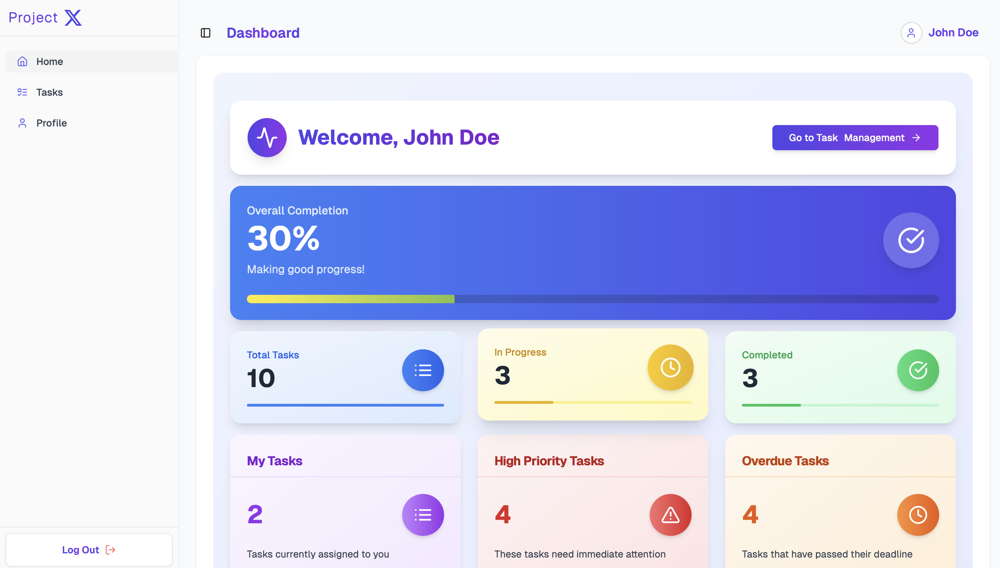

# Project Management App



## Overview

This project is a **Task Management & Collaboration Tool** built using the **T3 Stack**. It offers a modern user-friendly interface for efficient task creation, assignment, and tracking, complemented by robust user profile management and an insightful dashboard.

## Tech Stack

- **Next.js (T3 Stack)** - Core framework for React-based frontend
- **Supabase** - Database and authentication
- **TypeScript** - Type safety and improved developer experience
- **TailwindCSS** - For fast and flexible styling
- **PrismaORM** - Database ORM for efficient queries and migrations
- **Lucid-react** - For advanced UI components
- **shadcn** - Customizable UI components with accessibility
- **SST (Serverless Stack)** - For serverless infrastructure management
- **GitHub Actions** - CI/CD pipeline for deployment automation
- **AWS** - Hosting and serverless backend
- **React Hooks** - For state and logic management in components

---

## Project Structure

```
/ ── src
    ├── app
    ├── components
    ├── hooks
    ├── lib
    ├── pages
    ├── public
    ├── styles
    ├── utils
    ├── prisma
    └── tests
```

### Key Directories

- **`components/`**: shadcn UI Components
- **`hooks/`**: Custom React hooks for shared logic
- **`lib/`**: Utility functions and services
- **`pages/`**: Traditional Next.js pages structure (e.g., `/home`, `/tasks`, `/profile`)
- **`src/`**: Reusable UI components and Custom React hooks for shared logic
- **`public/`**: Static assets such as images and icons
- **`styles/`**: Global and component-specific styling
- **`utils/`**: General-purpose utility functions
- **`prisma/`**: Prisma schema and migration files
- **`tests/`**: Test cases for application logic and components

---

## Installation

### Prerequisites

- Node.js (v18+)
- NPM or Yarn
- Supabase account
- AWS account

### Steps

1. Clone the repository:
   ```bash
   git clone https://github.com/remeezsanik/project-management-app.git
   cd ProjectManagementApp
   ```
2. Install dependencies:
   ```bash
   npm install
   ```
3. Create an `.env` file in the root directory and add the following keys:
   ```env
   NEXT_PUBLIC_SUPABASE_URL=your-supabase-url
   NEXT_PUBLIC_SUPABASE_ANON_KEY=your-supabase-anon-key
   DATABASE_URL=your-database-url
   AWS_ACCESS_KEY_ID=your-aws-access-key-id
   AWS_SECRET_ACCESS_KEY=your-aws-secret-access-key
   ```
4. Run Prisma migrations:
   ```bash
   npx prisma db push
   ```
5. Start the development server:
   ```bash
   npm run dev
   ```
6. Visit [http://localhost:3000](http://localhost:3000)

---

## Testing

Testing is implemented using **Jest** and **React Testing Library**.

- Run unit tests:
  ```bash
  npm run test
  ```
- Run end-to-end tests:
  ```bash
  npm run test:e2e
  ```

---

## Deployment

Deployment is automated using **GitHub Actions** and **SST** for serverless deployment to AWS.

### Deployment Steps

1. Configure AWS credentials in your GitHub repository's Secrets.
2. Add `.github/workflows/deploy.yml` with the following content:

```yaml
name: Deploy to AWS

env:
  AWS_REGION: your-aws-region

ojobs:
  deploy:
    runs-on: ubuntu-latest
    steps:
      - name: Checkout Repository
        uses: actions/checkout@v4

      - name: Install Dependencies
        run: npm install

      - name: Deploy to AWS
        run: npx sst deploy
```

3. Commit and push your changes. The deployment will trigger automatically.

## 🤝 Contributors

- **👨‍💻 REMEEZ SANIK** - [🔗 GitHub](https://github.com/remeezsanik)

# project-management-app
